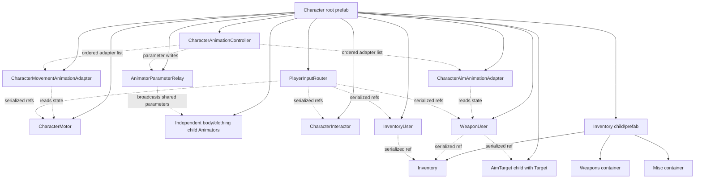
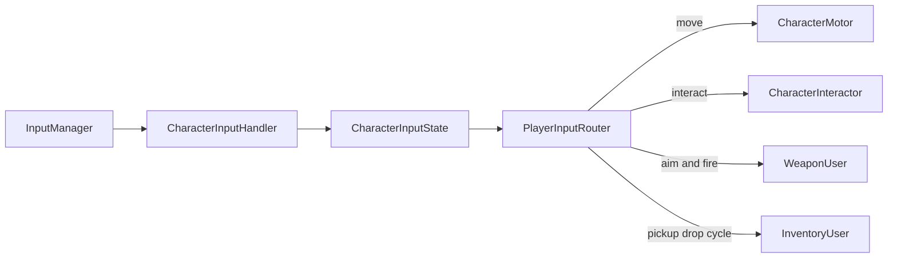
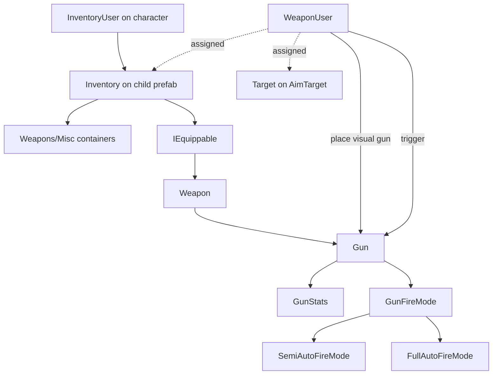
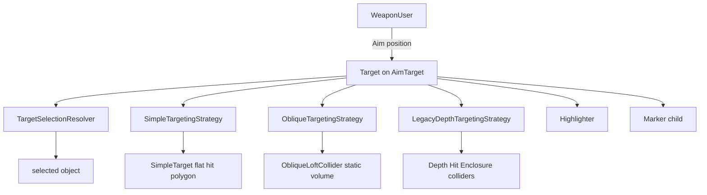
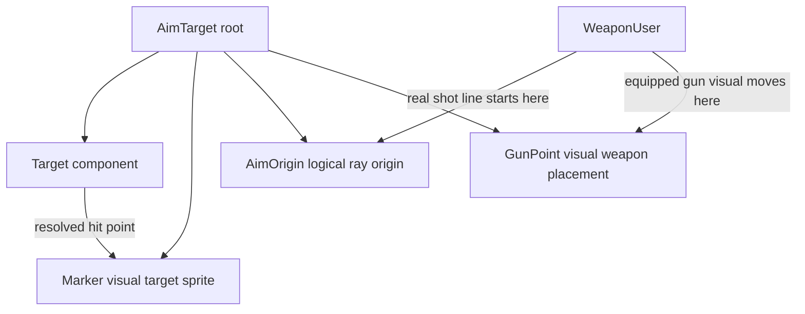
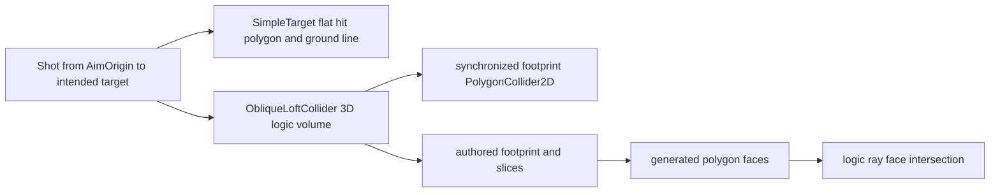
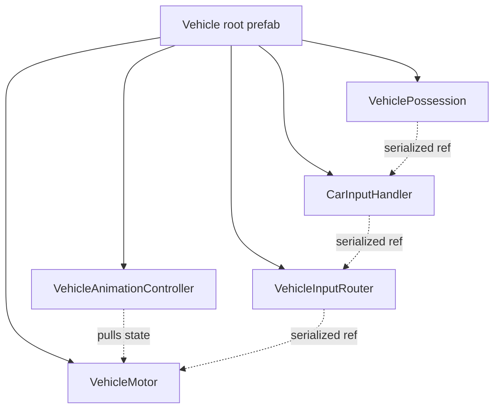

# Architecture Diagrams

These diagrams show the component ownership architecture after the composition migration. The important rule is that stable owner relationships are serialized explicitly on the owning prefab or component. There is no runtime entity index, universal refs object, broad lookup service, or transition controller layer in the architecture.

If a Markdown Mermaid preview fails, the text under each diagram is the same architecture in plain form.

## Character Entity Wiring

Plain view:

- Character root owns the character capability components.
- `CharacterAnimationController` ticks itself, invokes its ordered animation adapter list, and owns final character parameter writes through `AnimatorParameterRelay`.
- `AnimatorParameterRelay` broadcasts shared parameters to independent visible layer animators; it does not force a common state/time.
- Character Builder generated override controllers are also independent per layer: each part group uses its own template controller under `Base/Templates/` and its own slot placeholders under `Base/Slots/<part-group>/`.
- `CharacterMovementAnimationAdapter` reads `CharacterMotor`; `CharacterAimAnimationAdapter` reads `WeaponUser`.
- Enable or disable the aim adapter component to control whether aim parameters are written.
- `PlayerInputRouter` has explicit fields for movement, interaction, weapon, and inventory receivers.
- `Inventory` lives on the `Inventory` child/prefab with assigned `Weapons` and `Misc` item containers.
- `WeaponUser` and `InventoryUser` use assigned `Target` / `Inventory` references, with narrow local hierarchy fallback only for missing local fields.

## Character Input Flow

Input is translated into typed state before gameplay sees it. Gameplay components receive commands through focused capability interfaces and explicit router fields.

## Weapon And Inventory Flow

Inventory rules depend on `IEquippable`, not concrete weapon subclasses. Gun trigger behavior is delegated to fire-mode components.

## Aim And Targeting Flow

`Target` is the shooter-side targetter and marker presenter. Selection and LOS decisions are delegated to strategies. The old depth/hit/enclosure path remains as fallback.

## AimTarget Points

Targeting math uses `AimOrigin`. `GunPoint` is visual and can be animation-frame specific. The marker moves to the resolved target point; the `AimTarget` root stays anchored to the character.

## SimpleTarget And Oblique Loft

Use `SimpleTarget` for animated or moving shootable targets. Use `ObliqueLoftCollider` for mostly-static blockers and direct static targets.

## Vehicle Wiring

`VehicleMotor` owns driving state and receives typed vehicle input. `VehicleAnimationController` ticks itself and pulls state from `VehicleMotor` before writing animator parameters. `VehiclePossession` owns enter/exit and input switching.
